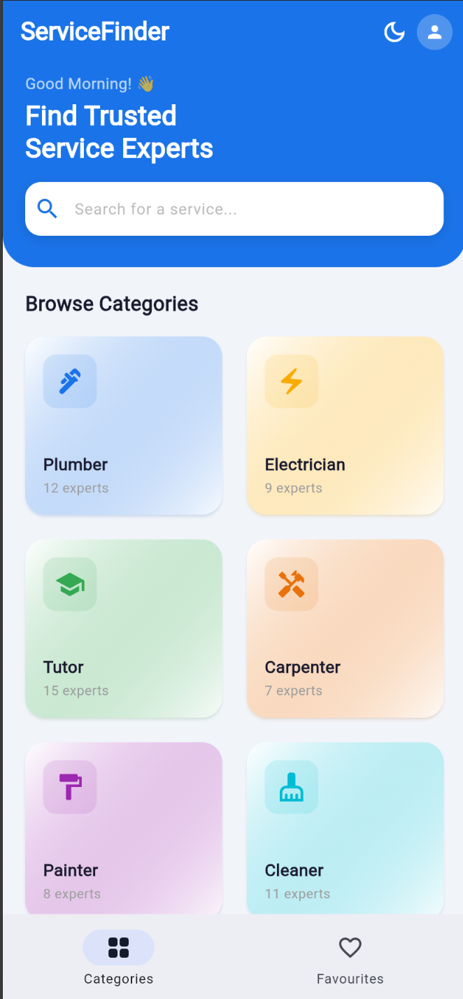
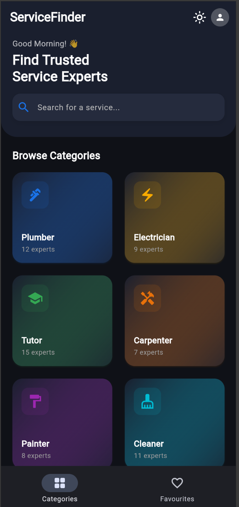
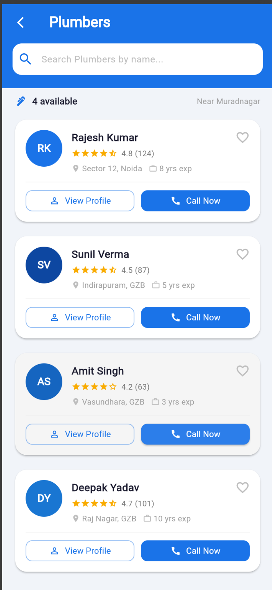
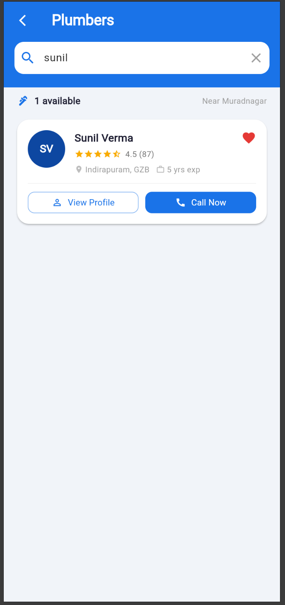
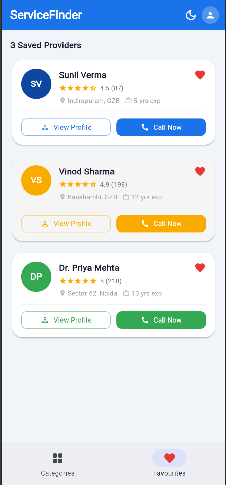
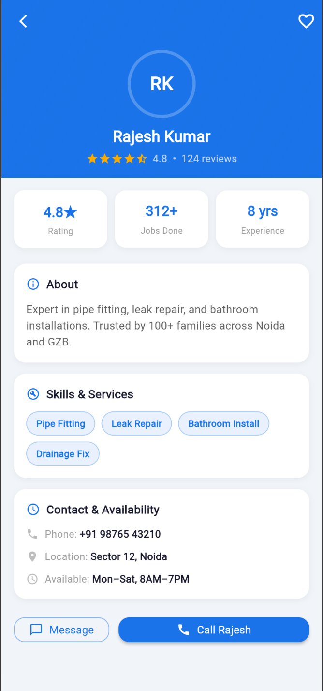

<div align="center">


<br/><br/>

# 🔧 ServiceFinder

### A modern, minimal Flutter app to discover and contact trusted local service professionals

*Plumbers · Electricians · Tutors · Carpenters · Painters · Cleaners · Mechanics · Gardeners*

<br/>

</div>

---

## 📋 Table of Contents

- [Overview](#-overview)
- [Tech Stack](#-tech-stack)
- [Features](#-features)
- [App Flow](#-app-flow)
- [Project Structure](#-project-structure)
- [Getting Started](#-getting-started)
- [Screenshots](#-screenshots)

---

## 🌟 Overview

**ServiceFinder** is a clean, fast, directory-style Flutter app that helps users find and contact local service professionals near them. Browse by category, filter by name, view detailed profiles, bookmark favourites, and call directly — all in one smooth experience.

Built entirely in a **single `main.dart` file** using **zero external packages** — powered only by the Flutter SDK and Material Design 3.

> 

---

## 🛠 Tech Stack

<div align="center">

| Layer | Technology |
|-------|-----------|
| **Framework** | Flutter 3.x |
| **Language** | Dart 3.x |
| **Design System** | Material Design 3 |
| **State Management** | `ChangeNotifier` + `setState` |
| **Navigation** | `Navigator.push` / `Navigator.pop` |
| **Theming** | `ThemeData` — Light & Dark |
| **External Packages** | None |

</div>

---

## ✨ Features

### Core
- 🗂 **Category Grid** — 2-column `GridView` with 8 service categories, icons, and provider counts
- 📋 **Provider List** — scrollable list of professionals per selected category
- ⭐ **Star Ratings** — precise half-star ratings using Flutter built-in icons
- 🔍 **Live Search** — real-time name filtering as you type
- 📞 **Call Now** — floating `SnackBar` with provider name and phone number
- 🔀 **Multi-screen Navigation** — smooth `Navigator.push` routing

### Highlights
- 🌙 **Dark Mode** — full app-wide theme switch, every screen adapts instantly
- ❤️ **Favourites** — animated heart bookmark, badge counter, dedicated saved tab
- 📊 **Provider Profile** — `SliverAppBar` with Hero animation, stats row, skills chips, and availability info

---

## 🗺 App Flow

```
                        ┌──────────────────────────────┐
                        │         App Launch            │
                        │      ServiceFinderApp         │
                        └──────────────┬───────────────┘
                                       │
                                       ▼
                   ┌───────────────────────────────────────┐
                   │        Screen 1 — Category Home        │
                   │                                        │
                   │   Hero Banner  +  Search Bar           │
                   │   ┌─────────┐  ┌─────────┐            │
                   │   │Plumber  │  │Electricn│            │
                   │   ├─────────┤  ├─────────┤            │
                   │   │ Tutor   │  │Carpenter│  ...       │
                   │   └─────────┘  └─────────┘            │
                   │                                        │
                   │  [Categories]       [Favourites ❤️]    │
                   └────────┬──────────────────┬───────────┘
                            │ tap category      │ tap tab
                            ▼                  ▼
             ┌──────────────────────┐  ┌────────────────────┐
             │  Screen 2 —          │  │  Favourites Tab     │
             │  Provider List       │  │                     │
             │                      │  │  All saved cards    │
             │  [ Search by name ]  │  │  Badge counter      │
             │                      │  │  Call / Profile     │
             │  ★★★★½  Rajesh Kumar │  └────────┬───────────┘
             │  ★★★★☆  Sunil Verma  │           │
             │  ★★★★★  Deepak Yadav │           │ tap provider
             │                      │◄──────────┘
             │  [View Profile] [📞] │
             └──────┬───────────────┘
                    │                    📞 Call Now
                    │ tap View Profile   └──► SnackBar
                    ▼                        (name + phone)
     ┌──────────────────────────────────────────┐
     │         Screen 3 — Provider Profile       │
     │                                           │
     │   ╔══════════════════════════════════╗    │
     │   ║   [← Back]    Plumbers   [❤️]   ║    │
     │   ║                                  ║    │
     │   ║          ┌────────┐              ║    │
     │   ║          │   RK   │  Hero Avatar ║    │
     │   ║          └────────┘              ║    │
     │   ║       Rajesh Kumar               ║    │
     │   ║       ★★★★½  4.8 · 124 reviews  ║    │
     │   ╚══════════════════════════════════╝    │
     │                                           │
     │   ┌─────────┬───────────┬────────────┐   │
     │   │  4.8★   │  312 Jobs │  8 yrs exp │   │
     │   └─────────┴───────────┴────────────┘   │
     │                                           │
     │   About        ──────────────────────     │
     │   Skills       [Pipe Fitting] [Leak Fix]  │
     │   Availability  Mon–Sat, 8AM–7PM          │
     │                                           │
     │   [ Message ]     [ Call Rajesh ]         │
     └───────────────────────────────────────────┘


  ┌─────────────────────────────────────────────────────┐
  │         Global AppState  (ChangeNotifier)            │
  │                                                      │
  │   isDark ──────────────► ThemeMode (all screens)    │
  │   favourites (Set) ─────► badge + Favourites tab    │
  │   notifyListeners() ────► rebuilds entire UI        │
  └─────────────────────────────────────────────────────┘
```

---

## 📁 Project Structure

```
service_finder/
│
├── lib/
│   └── main.dart
│       │
│       ├── AppState                 global state (dark mode + favourites)
│       ├── ServiceFinderApp         MaterialApp root, theme config
│       │
│       ├── Models
│       │   ├── ServiceCategory      name, icon, color, providerCount
│       │   └── ServiceProvider      name, rating, phone, skills, about...
│       │
│       ├── Data
│       │   ├── categories[]         8 service categories
│       │   └── providerData{}       32 professionals across all categories
│       │
│       ├── Screens
│       │   ├── CategoryScreen       Screen 1 — grid + search + bottom nav
│       │   ├── ProviderListScreen   Screen 2 — filtered list + search bar
│       │   └── ProviderProfileScreen Screen 3 — detail view, SliverAppBar
│       │
│       └── Widgets
│           ├── _CategoryCard        category grid tile
│           └── _ProviderCard        provider list card with heart + buttons
│
├── android/                         Flutter auto-generated (C++ / CMake)
├── ios/                             Flutter auto-generated (Swift)
├── pubspec.yaml                     zero external dependencies
└── README.md
```

---

## 🚀 Getting Started

### Prerequisites

- [Flutter SDK 3.0+](https://flutter.dev/docs/get-started/install)
- Android Studio with Flutter & Dart plugins
- Android Emulator or physical device

Verify your setup:

```bash
flutter doctor
```

### Run locally

```bash
# Clone the repo
git clone https://github.com/shrajal01/service-finder-app.git

# Enter the project directory
cd service-finder-app

# Get Flutter dependencies
flutter pub get

# Launch the app
flutter run
```

---

## 📸 Screenshots

|             Category Grid              |             Dark Mode              |              Provider List              |
|:--------------------------------------:|:----------------------------------:|:---------------------------------------:|
| ** | ** | ** |

|            Search Filter             |               Favourites Tab                |           Provider Profile            |
|:------------------------------------:|:-------------------------------------------:|:-------------------------------------:|
| ** | *screenshot* | ** |


---

<div align="center">

Made with Flutter · Material Design 3 · Zero Dependencies


</div>